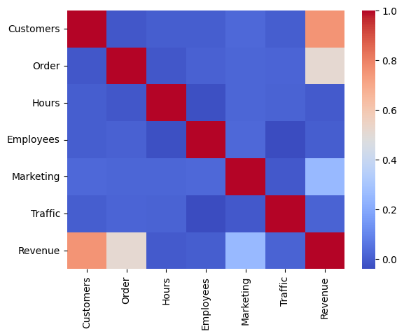

# coffee-shop-marketing

## Introduction

This analysis is based on a Kaggle dataset of 2,000 coffee shops with data on the coffee shop itself, its daily operations, and revenue. The analysis focuses on two questions:
1. Are there meaningful types of coffee shops?
2. Does these groups benefit differently from marketing?

### Variables
* Customers: Number of Customers Per Day 

* Order: Average Order Value ($) 

* Hours: Operating Hours Per Day

* Employees: Number of Employees

* Marketing: Marketing Spend Per Day ($)

* Traffic: Location Foot Traffic (people/hour)

* Revenue: Daily Revenue ($)

## Description of Data

A quick review of the variables showed no missing variables and each variable was either a float or integer. The tables and graphs below show the distribution properties of each variable. Only Revenue approximates a normal distribution with the other variables having a roughly uniform distrbution. 

<table border="1" class="dataframe">
  <thead>
    <tr style="text-align: right;">
      <th></th>
      <th>Customers</th>
      <th>Order</th>
      <th>Hours</th>
      <th>Employees</th>
      <th>Marketing</th>
      <th>Traffic</th>
      <th>Revenue</th>
    </tr>
  </thead>
  <tbody>
    <tr>
      <th>count</th>
      <td>2000.000000</td>
      <td>2000.000000</td>
      <td>2000.000000</td>
      <td>2000.000000</td>
      <td>2000.000000</td>
      <td>2000.000000</td>
      <td>2000.000000</td>
    </tr>
    <tr>
      <th>mean</th>
      <td>274.296000</td>
      <td>6.261215</td>
      <td>11.667000</td>
      <td>7.947000</td>
      <td>252.614160</td>
      <td>534.893500</td>
      <td>1917.325940</td>
    </tr>
    <tr>
      <th>std</th>
      <td>129.441933</td>
      <td>2.175832</td>
      <td>3.438608</td>
      <td>3.742218</td>
      <td>141.136004</td>
      <td>271.662295</td>
      <td>976.202746</td>
    </tr>
    <tr>
      <th>min</th>
      <td>50.000000</td>
      <td>2.500000</td>
      <td>6.000000</td>
      <td>2.000000</td>
      <td>10.120000</td>
      <td>50.000000</td>
      <td>-58.950000</td>
    </tr>
    <tr>
      <th>25%</th>
      <td>164.000000</td>
      <td>4.410000</td>
      <td>9.000000</td>
      <td>5.000000</td>
      <td>130.125000</td>
      <td>302.000000</td>
      <td>1140.085000</td>
    </tr>
    <tr>
      <th>50%</th>
      <td>275.000000</td>
      <td>6.300000</td>
      <td>12.000000</td>
      <td>8.000000</td>
      <td>250.995000</td>
      <td>540.000000</td>
      <td>1770.775000</td>
    </tr>
    <tr>
      <th>75%</th>
      <td>386.000000</td>
      <td>8.120000</td>
      <td>15.000000</td>
      <td>11.000000</td>
      <td>375.352500</td>
      <td>767.000000</td>
      <td>2530.455000</td>
    </tr>
    <tr>
      <th>max</th>
      <td>499.000000</td>
      <td>10.000000</td>
      <td>17.000000</td>
      <td>14.000000</td>
      <td>499.740000</td>
      <td>999.000000</td>
      <td>5114.600000</td>
    </tr>
  </tbody>
</table>
</div>


    

    

## Correlations between Variables

Taking into account the distribution and differences in scales between the variables, Spearman rank correlations are used to examine the associations between variables. The heatmap below shows the level of correlation with most pairs having low levels of correlation (blue and dark blue). Not unexpectedly, the strongest relationshipss are between revenue, the number of customers, and the average order per customer. A modest relationship does exist with the amount of daily marketing spend and daily revenue, however, as well. A further review of scatter plots between variables shows that the relationships that do exist appear to be linear. 


### Spearman Rank Correlations Among Variables


    

### Scatter Plots Between Variables 


    

## Cluster Analysis of Data

Cluster analysis is used to see if there are distinct groups of coffee shops based on qualities about the shop and its operations. To avoid the disproportionate influence of one variable over another due to scale, a standard scaler is applied to the following variables used in the cluster analysis:
* Customers
* Order
* Hours
* Employees
* Traffic

A k-means cluster analysis technique is utilized to determine the optimal number of clusters. The analysis iterates to minimize the within-cluster sum-of-squares, based on euclidean distance from a centroid. The elbow graph below shows the average within cluster sum-of-squares with each k (number of clusters). Ideally, the optimal number of clusters is located where there is bend (elbow) in the curve but that is not obvious from the graph. An alternative measure is the sillouette score. While the WCSS measures how closely the points are to the centroid and one another in the cluster. The sillouette score combines both the WCSS and a measure of distance between clusters. Sillouette scores close to 1 indicate a high distinctiveness of clusters while those close to -1 indicate possible misclassification. 

```python
wcss = [] # Within-cluster sum of squares
for i in range(1, 11): # Test k from 1 to 10
        kmeans = KMeans(n_clusters=i, init='k-means++', max_iter=300, n_init=10, random_state=0)
        kmeans.fit(shop)
        wcss.append(kmeans.inertia_)
    
# Plot the elbow graph
plt.plot(range(1, 11), wcss)
plt.title('Elbow Method')
plt.xlabel('Number of clusters (k)')
plt.ylabel('WCSS')
plt.show()
```
   

    


```python
silhouette_scores = []
k_range = range(2, 11)  # Test cluster numbers from 2 to 10

for k in k_range:

    kmeans = KMeans(n_clusters=k, random_state=42)
    labels = kmeans.fit_predict(shop)
    silhouette_avg = silhouette_score(shop, labels)
    silhouette_scores.append(silhouette_avg)

plt.plot(k_range, silhouette_scores)
plt.xlabel("Number of clusters (k)")
plt.ylabel("Silhouette score")
plt.title("Silhouette analysis for optimal k")
plt.show()
```
   

    
## Characteristics of Clusters

   

    
   

    
    

    
    

    
    

    


## Predicting the Impact of Marketing Spend on Revenue

|Cluster|Descriptor|R-squared|B0|Marketing|
|---:|---:|---:|---:|---:|
|0| Speciality Hangout|0.04|1454.49|0.99|
|1| Drive Thru Chain|0.10|1491.42|1.49|
|2| Hybrid Coffee Shop|0.20|671.17|1.47|
|3| Suburban Cafe|0.06|2559.61|1.48|
|4| Startup Cafe|0.18|893.92|1.93|
|5| Downtown Morning Rush|0.07|1662.73|1.43|
|6| Downtown Boutique|0.13|1283.53|1.98|
|7| Coffee Bar|0.13|2523.45|2.08|
|8| Neighborhood Nonprofit|0.08|898.91|1.00|

 
