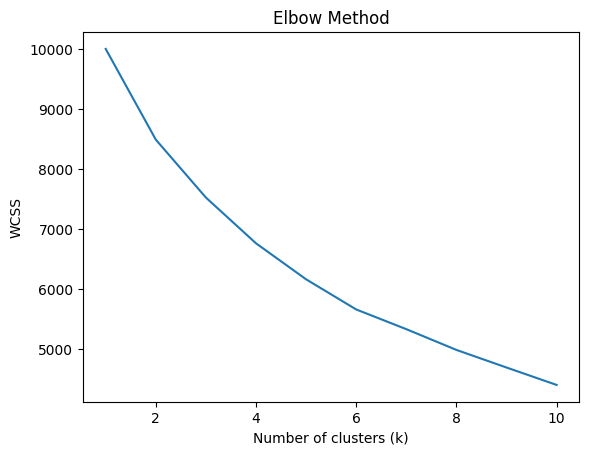
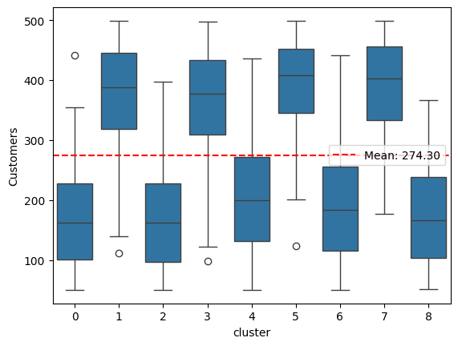

# coffee-shop-marketing

## Introduction

This analysis is based on a Kaggle dataset of 2,000 coffee shops with data on the coffee shop itself, its daily operations, and revenue. The analysis focuses on two questions:
1. Are there meaningful types of coffee shops?
2. Does these groups benefit differently from marketing?

### Variables
* Customers: Number of Customers Per Day 

* Order: Average Order Value ($) 

* Hours: Operating Hours Per Day

* Employees: Number of Employees

* Marketing: Marketing Spend Per Day ($)

* Traffic: Location Foot Traffic (people/hour)

* Revenue: Daily Revenue ($)

## Description of Data

A quick review of the variables showed no missing variables and each variable was either a float or integer. The tables and graphs below show the distribution properties of each variable. Only Revenue approximates a normal distribution with the other variables having a roughly uniform distrbution. 

<table border="1" class="dataframe">
  <thead>
    <tr style="text-align: right;">
      <th></th>
      <th>Customers</th>
      <th>Order</th>
      <th>Hours</th>
      <th>Employees</th>
      <th>Marketing</th>
      <th>Traffic</th>
      <th>Revenue</th>
    </tr>
  </thead>
  <tbody>
    <tr>
      <th>count</th>
      <td>2000.000000</td>
      <td>2000.000000</td>
      <td>2000.000000</td>
      <td>2000.000000</td>
      <td>2000.000000</td>
      <td>2000.000000</td>
      <td>2000.000000</td>
    </tr>
    <tr>
      <th>mean</th>
      <td>274.296000</td>
      <td>6.261215</td>
      <td>11.667000</td>
      <td>7.947000</td>
      <td>252.614160</td>
      <td>534.893500</td>
      <td>1917.325940</td>
    </tr>
    <tr>
      <th>std</th>
      <td>129.441933</td>
      <td>2.175832</td>
      <td>3.438608</td>
      <td>3.742218</td>
      <td>141.136004</td>
      <td>271.662295</td>
      <td>976.202746</td>
    </tr>
    <tr>
      <th>min</th>
      <td>50.000000</td>
      <td>2.500000</td>
      <td>6.000000</td>
      <td>2.000000</td>
      <td>10.120000</td>
      <td>50.000000</td>
      <td>-58.950000</td>
    </tr>
    <tr>
      <th>25%</th>
      <td>164.000000</td>
      <td>4.410000</td>
      <td>9.000000</td>
      <td>5.000000</td>
      <td>130.125000</td>
      <td>302.000000</td>
      <td>1140.085000</td>
    </tr>
    <tr>
      <th>50%</th>
      <td>275.000000</td>
      <td>6.300000</td>
      <td>12.000000</td>
      <td>8.000000</td>
      <td>250.995000</td>
      <td>540.000000</td>
      <td>1770.775000</td>
    </tr>
    <tr>
      <th>75%</th>
      <td>386.000000</td>
      <td>8.120000</td>
      <td>15.000000</td>
      <td>11.000000</td>
      <td>375.352500</td>
      <td>767.000000</td>
      <td>2530.455000</td>
    </tr>
    <tr>
      <th>max</th>
      <td>499.000000</td>
      <td>10.000000</td>
      <td>17.000000</td>
      <td>14.000000</td>
      <td>499.740000</td>
      <td>999.000000</td>
      <td>5114.600000</td>
    </tr>
  </tbody>
</table>
</div>


    

    

## Correlations between Variables

Taking into account the distribution and differences in scales between the variables, Spearman rank correlations are used to examine the associations between variables. The heatmap below shows the level of correlation with most pairs having low levels of correlation (blue and dark blue). Not unexpectedly, the strongest relationshipss are between revenue, the number of customers, and the average order per customer. A modest relationship does exist with the amount of daily marketing spend and daily revenue, however, as well. A further review of scatter plots between variables shows that the relationships that do exist appear to be linear. 


### Spearman Rank Correlations Among Variables


    

### Scatter Plots Between Variables 


    

## Cluster Analysis of Data

Cluster analysis is used to see if there are distinct groups of coffee shops based on qualities about the shop and its operations. To avoid the disproportionate influence of one variable over another due to scale, a standard scaler is applied to the following variables used in the cluster analysis:
* Customers
* Order
* Hours
* Employees
* Traffic

A k-means cluster analysis technique is utilized to determine the optimal number of clusters. The analysis iterates to minimize the within-cluster sum-of-squares, based on euclidean distance from a centroid. The elbow graph below shows the average within cluster sum-of-squares with each k (number of clusters). Ideally, the optimal number of clusters is located where there is bend (elbow) in the curve but that is not obvious from the graph. An alternative measure is the sillouette score. While the WCSS measures how closely the points are to the centroid and one another in the cluster. The sillouette score combines both the WCSS and a measure of distance between clusters. Sillouette scores close to 1 indicate a high distinctiveness of clusters while those close to -1 indicate possible misclassification. 

```python
wcss = [] # Within-cluster sum of squares
for i in range(1, 11): # Test k from 1 to 10
        kmeans = KMeans(n_clusters=i, init='k-means++', max_iter=300, n_init=10, random_state=0)
        kmeans.fit(shop)
        wcss.append(kmeans.inertia_)
    
# Plot the elbow graph
plt.plot(range(1, 11), wcss)
plt.title('Elbow Method')
plt.xlabel('Number of clusters (k)')
plt.ylabel('WCSS')
plt.show()
```
   

    


```python
silhouette_scores = []
k_range = range(2, 11)  # Test cluster numbers from 2 to 10

for k in k_range:

    kmeans = KMeans(n_clusters=k, random_state=42)
    labels = kmeans.fit_predict(shop)
    silhouette_avg = silhouette_score(shop, labels)
    silhouette_scores.append(silhouette_avg)

plt.plot(k_range, silhouette_scores)
plt.xlabel("Number of clusters (k)")
plt.ylabel("Silhouette score")
plt.title("Silhouette analysis for optimal k")
plt.show()
```
   

    
## Characteristics of Clusters

   

    
   

    
    

    
    

    
    

    


    
```python
mean_by_cluster = coffee2.groupby("cluster")[['Customers_scaled', 'Order_scaled', 'Hours_scaled', 'Employees_scaled', 'Traffic_scaled']].mean()
print(mean_by_category)


```

             Customers_scaled  Order_scaled  Hours_scaled  Employees_scaled  \
    cluster                                                                   
    0               -0.784315      0.967888      0.637277         -0.661410   
    1                0.773254     -0.861459      0.526212         -0.325488   
    2               -0.815282     -0.879191      0.423269         -0.910464   
    3                0.705752      0.723088     -0.434840          0.841226   
    4               -0.532417     -0.372994      0.778215          1.049393   
    5                0.919299     -0.765818     -0.763090          0.204901   
    6               -0.638339      0.840566     -0.921889          0.163848   
    7                0.910791      0.650923      0.602222         -0.666512   
    8               -0.763510     -0.604507     -0.980805         -0.116932   
    
             Traffic_scaled  
    cluster                  
    0             -0.639678  
    1             -1.009832  
    2              0.803402  
    3             -0.775974  
    4              0.335564  
    5              0.799682  
    6              0.808509  
    7              0.735848  
    8             -0.884296  


```python

df = pd.DataFrame(mean_by_cluster)

# Define the recode function
def recode_integer_to_string(x):
    if pd.isna(x):
        return "Out of Range"
    if isinstance(x, (int, float)):  # Check if the value is numeric
        if x <= -0.5:
            return "Low"
        elif -0.5 < x <= 0.5:
            return "Medium"
        elif x > 0.5:
            return "High"
    return "Invalid"

# Apply recoding to multiple columns
columns_to_recode = ['Customers_scaled', 'Order_scaled', 'Hours_scaled', 'Employees_scaled', 'Traffic_scaled']

for column in columns_to_recode:
    df[f'{column}_recode'] = df[column].apply(recode_integer_to_string)

df2=df[['Customers_scaled_recode', 'Order_scaled_recode', 'Hours_scaled_recode', 'Employees_scaled_recode', 'Traffic_scaled_recode']]

# Display the updated DataFrame
print(df2)

```

            Customers_scaled_recode Order_scaled_recode Hours_scaled_recode  \
    cluster 
    
    0                           Low                High                High   
    1                          High                 Low                High   
    2                           Low                 Low              Medium   
    3                          High                High              Medium   
    4                           Low              Medium                High   
    5                          High                 Low                 Low   
    6                           Low                High                 Low   
    7                          High                High                High   
    8                           Low                 Low                 Low   
    
            Employees_scaled_recode Traffic_scaled_recode  
    cluster                                                
    0                           Low                   Low  
    1                        Medium                   Low  
    2                           Low                  High  
    3                          High                   Low  
    4                          High                Medium  
    5                        Medium                  High  
    6                        Medium                  High  
    7                           Low                  High  
    8                        Medium                   Low  


|Cluster|Descriptor|Customers|Order|Hours|Employees|Traffic|
|---:|---:|---:|---:|---:|---:|---:|   
|0| Speciality Hangout|Low  | High | High | Low| Low | 
|1| Drive Thru Chain| High | Low |High | Medium | Low|
|2| Hybrid Coffee Shop| Low | Low |Medium |Low| High|
|3| Suburban Cafe|High   | High |Medium |High|Low|
|4| Startup Cafe|Low   | Medium |High  |High|Medium| 
|5| Downtown Morning Rush|High   | Low |Low |Medium|High|
|6| Downtown Boutique|Low   | High |Low |Medium|High|
|7| Coffee Bar| High| High |High  |Low|High| 
|8| Neighborhood Nonprofit|Low | Low | Low   |Medium|Low|

 


    
            Employees_scaled_recode Traffic_scaled_recode  
    cluster                                                
    0                           Low                   Low  
    1                        Medium                   Low  
    2                           Low                  High  
    3                          High                   Low  
    4                          High                Medium  
    5                        Medium                  High  
    6                        Medium                  High  
    7                           Low                  High  
    8                        Medium                   Low 


```python
counts = coffee2['cluster'].value_counts()
print(counts)
```

    cluster
    4    260
    3    244
    7    236
    1    229
    6    225
    0    218
    8    210
    5    206
    2    172
    Name: count, dtype: int64


```python


# Fit separate models
model_A = sm.OLS(result[result['cluster'] == 0]['Revenue'], sm.add_constant(result[result['cluster']== 0]['Marketing'])).fit()
model_B = sm.OLS(result[result['cluster'] == 1]['Revenue'], sm.add_constant(result[result['cluster']== 1]['Marketing'])).fit()
model_C = sm.OLS(result[result['cluster'] == 2]['Revenue'], sm.add_constant(result[result['cluster']== 2]['Marketing'])).fit()
model_D = sm.OLS(result[result['cluster'] == 3]['Revenue'], sm.add_constant(result[result['cluster']== 3]['Marketing'])).fit()
model_E = sm.OLS(result[result['cluster'] == 4]['Revenue'], sm.add_constant(result[result['cluster']== 4]['Marketing'])).fit()
model_F = sm.OLS(result[result['cluster'] == 5]['Revenue'], sm.add_constant(result[result['cluster']== 5]['Marketing'])).fit()
model_G = sm.OLS(result[result['cluster'] == 6]['Revenue'], sm.add_constant(result[result['cluster']== 6]['Marketing'])).fit()
model_H = sm.OLS(result[result['cluster'] == 7]['Revenue'], sm.add_constant(result[result['cluster']== 7]['Marketing'])).fit()
model_I = sm.OLS(result[result['cluster'] == 8]['Revenue'], sm.add_constant(result[result['cluster']== 8]['Marketing'])).fit()

# Print model summaries
print("Model A Summary:")
print(model_A.summary())
print("Model B Summary:")
print(model_B.summary())
print("Model C Summary:")
print(model_C.summary())
print("Model D Summary:")
print(model_D.summary())
print("Model E Summary:")
print(model_E.summary())
print("Model F Summary:")
print(model_F.summary())
print("Model G Summary:")
print(model_G.summary())
print("Model H Summary:")
print(model_H.summary())

```

    Model A Summary:
                                OLS Regression Results                            
    ==============================================================================
    Dep. Variable:                Revenue   R-squared:                       0.038
    Model:                            OLS   Adj. R-squared:                  0.034
    Method:                 Least Squares   F-statistic:                     8.636
    Date:                Fri, 07 Mar 2025   Prob (F-statistic):            0.00365
    Time:                        11:05:28   Log-Likelihood:                -1735.0
    No. Observations:                 218   AIC:                             3474.
    Df Residuals:                     216   BIC:                             3481.
    Df Model:                           1                                         
    Covariance Type:            nonrobust                                         
    ==============================================================================
                     coef    std err          t      P>|t|      [0.025      0.975]
    ------------------------------------------------------------------------------
    const       1454.4886     96.819     15.023      0.000    1263.658    1645.319
    Marketing      0.9925      0.338      2.939      0.004       0.327       1.658
    ==============================================================================
    Omnibus:                       10.618   Durbin-Watson:                   2.195
    Prob(Omnibus):                  0.005   Jarque-Bera (JB):               10.991
    Skew:                           0.547   Prob(JB):                      0.00411
    Kurtosis:                       3.122   Cond. No.                         589.
    ==============================================================================
    
    Notes:
    [1] Standard Errors assume that the covariance matrix of the errors is correctly specified.
    Model B Summary:
                                OLS Regression Results                            
    ==============================================================================
    Dep. Variable:                Revenue   R-squared:                       0.101
    Model:                            OLS   Adj. R-squared:                  0.097
    Method:                 Least Squares   F-statistic:                     25.42
    Date:                Fri, 07 Mar 2025   Prob (F-statistic):           9.44e-07
    Time:                        11:05:28   Log-Likelihood:                -1806.6
    No. Observations:                 229   AIC:                             3617.
    Df Residuals:                     227   BIC:                             3624.
    Df Model:                           1                                         
    Covariance Type:            nonrobust                                         
    ==============================================================================
                     coef    std err          t      P>|t|      [0.025      0.975]
    ------------------------------------------------------------------------------
    const       1491.4231     85.097     17.526      0.000    1323.741    1659.105
    Marketing      1.4926      0.296      5.042      0.000       0.909       2.076
    ==============================================================================
    Omnibus:                       10.484   Durbin-Watson:                   2.014
    Prob(Omnibus):                  0.005   Jarque-Bera (JB):               11.169
    Skew:                           0.539   Prob(JB):                      0.00376
    Kurtosis:                       2.903   Cond. No.                         571.
    ==============================================================================
    
    Notes:
    [1] Standard Errors assume that the covariance matrix of the errors is correctly specified.
    Model C Summary:
                                OLS Regression Results                            
    ==============================================================================
    Dep. Variable:                Revenue   R-squared:                       0.198
    Model:                            OLS   Adj. R-squared:                  0.193
    Method:                 Least Squares   F-statistic:                     41.91
    Date:                Fri, 07 Mar 2025   Prob (F-statistic):           9.85e-10
    Time:                        11:05:28   Log-Likelihood:                -1273.3
    No. Observations:                 172   AIC:                             2551.
    Df Residuals:                     170   BIC:                             2557.
    Df Model:                           1                                         
    Covariance Type:            nonrobust                                         
    ==============================================================================
                     coef    std err          t      P>|t|      [0.025      0.975]
    ------------------------------------------------------------------------------
    const        671.1674     64.540     10.399      0.000     543.764     798.570
    Marketing      1.4743      0.228      6.474      0.000       1.025       1.924
    ==============================================================================
    Omnibus:                       10.137   Durbin-Watson:                   2.030
    Prob(Omnibus):                  0.006   Jarque-Bera (JB):               10.641
    Skew:                           0.609   Prob(JB):                      0.00489
    Kurtosis:                       3.050   Cond. No.                         601.
    ==============================================================================
    
    Notes:
    [1] Standard Errors assume that the covariance matrix of the errors is correctly specified.
    Model D Summary:
                                OLS Regression Results                            
    ==============================================================================
    Dep. Variable:                Revenue   R-squared:                       0.063
    Model:                            OLS   Adj. R-squared:                  0.059
    Method:                 Least Squares   F-statistic:                     16.35
    Date:                Fri, 07 Mar 2025   Prob (F-statistic):           7.07e-05
    Time:                        11:05:28   Log-Likelihood:                -1966.7
    No. Observations:                 244   AIC:                             3937.
    Df Residuals:                     242   BIC:                             3944.
    Df Model:                           1                                         
    Covariance Type:            nonrobust                                         
    ==============================================================================
                     coef    std err          t      P>|t|      [0.025      0.975]
    ------------------------------------------------------------------------------
    const       2559.6101    110.483     23.167      0.000    2341.978    2777.242
    Marketing      1.4825      0.367      4.044      0.000       0.760       2.205
    ==============================================================================
    Omnibus:                       12.536   Durbin-Watson:                   1.846
    Prob(Omnibus):                  0.002   Jarque-Bera (JB):                5.480
    Skew:                           0.050   Prob(JB):                       0.0646
    Kurtosis:                       2.273   Cond. No.                         676.
    ==============================================================================
    
    Notes:
    [1] Standard Errors assume that the covariance matrix of the errors is correctly specified.
    Model E Summary:
                                OLS Regression Results                            
    ==============================================================================
    Dep. Variable:                Revenue   R-squared:                       0.182
    Model:                            OLS   Adj. R-squared:                  0.179
    Method:                 Least Squares   F-statistic:                     57.48
    Date:                Fri, 07 Mar 2025   Prob (F-statistic):           6.18e-13
    Time:                        11:05:28   Log-Likelihood:                -2023.0
    No. Observations:                 260   AIC:                             4050.
    Df Residuals:                     258   BIC:                             4057.
    Df Model:                           1                                         
    Covariance Type:            nonrobust                                         
    ==============================================================================
                     coef    std err          t      P>|t|      [0.025      0.975]
    ------------------------------------------------------------------------------
    const        893.9233     72.581     12.316      0.000     750.997    1036.850
    Marketing      1.9340      0.255      7.581      0.000       1.432       2.436
    ==============================================================================
    Omnibus:                       14.807   Durbin-Watson:                   1.873
    Prob(Omnibus):                  0.001   Jarque-Bera (JB):               16.273
    Skew:                           0.602   Prob(JB):                     0.000293
    Kurtosis:                       2.768   Cond. No.                         573.
    ==============================================================================
    
    Notes:
    [1] Standard Errors assume that the covariance matrix of the errors is correctly specified.
    Model F Summary:
                                OLS Regression Results                            
    ==============================================================================
    Dep. Variable:                Revenue   R-squared:                       0.073
    Model:                            OLS   Adj. R-squared:                  0.069
    Method:                 Least Squares   F-statistic:                     16.08
    Date:                Fri, 07 Mar 2025   Prob (F-statistic):           8.53e-05
    Time:                        11:05:28   Log-Likelihood:                -1650.9
    No. Observations:                 206   AIC:                             3306.
    Df Residuals:                     204   BIC:                             3313.
    Df Model:                           1                                         
    Covariance Type:            nonrobust                                         
    ==============================================================================
                     coef    std err          t      P>|t|      [0.025      0.975]
    ------------------------------------------------------------------------------
    const       1662.7274    100.402     16.561      0.000    1464.768    1860.687
    Marketing      1.4289      0.356      4.010      0.000       0.726       2.132
    ==============================================================================
    Omnibus:                       13.257   Durbin-Watson:                   1.977
    Prob(Omnibus):                  0.001   Jarque-Bera (JB):               14.673
    Skew:                           0.650   Prob(JB):                     0.000651
    Kurtosis:                       2.852   Cond. No.                         552.
    ==============================================================================
    
    Notes:
    [1] Standard Errors assume that the covariance matrix of the errors is correctly specified.
    Model G Summary:
                                OLS Regression Results                            
    ==============================================================================
    Dep. Variable:                Revenue   R-squared:                       0.129
    Model:                            OLS   Adj. R-squared:                  0.125
    Method:                 Least Squares   F-statistic:                     33.02
    Date:                Fri, 07 Mar 2025   Prob (F-statistic):           2.97e-08
    Time:                        11:05:28   Log-Likelihood:                -1805.7
    No. Observations:                 225   AIC:                             3615.
    Df Residuals:                     223   BIC:                             3622.
    Df Model:                           1                                         
    Covariance Type:            nonrobust                                         
    ==============================================================================
                     coef    std err          t      P>|t|      [0.025      0.975]
    ------------------------------------------------------------------------------
    const       1283.5284     98.924     12.975      0.000    1088.583    1478.474
    Marketing      1.9847      0.345      5.747      0.000       1.304       2.665
    ==============================================================================
    Omnibus:                       10.657   Durbin-Watson:                   1.787
    Prob(Omnibus):                  0.005   Jarque-Bera (JB):               11.034
    Skew:                           0.514   Prob(JB):                      0.00402
    Kurtosis:                       2.652   Cond. No.                         572.
    ==============================================================================
    
    Notes:
    [1] Standard Errors assume that the covariance matrix of the errors is correctly specified.
    Model H Summary:
                                OLS Regression Results                            
    ==============================================================================
    Dep. Variable:                Revenue   R-squared:                       0.134
    Model:                            OLS   Adj. R-squared:                  0.130
    Method:                 Least Squares   F-statistic:                     36.07
    Date:                Fri, 07 Mar 2025   Prob (F-statistic):           7.22e-09
    Time:                        11:05:28   Log-Likelihood:                -1896.7
    No. Observations:                 236   AIC:                             3797.
    Df Residuals:                     234   BIC:                             3804.
    Df Model:                           1                                         
    Covariance Type:            nonrobust                                         
    ==============================================================================
                     coef    std err          t      P>|t|      [0.025      0.975]
    ------------------------------------------------------------------------------
    const       2523.4494    103.213     24.449      0.000    2320.104    2726.795
    Marketing      2.0803      0.346      6.006      0.000       1.398       2.763
    ==============================================================================
    Omnibus:                       13.254   Durbin-Watson:                   2.043
    Prob(Omnibus):                  0.001   Jarque-Bera (JB):                7.905
    Skew:                           0.287   Prob(JB):                       0.0192
    Kurtosis:                       2.311   Cond. No.                         629.
    ==============================================================================
    
    Notes:
    [1] Standard Errors assume that the covariance matrix of the errors is correctly specified.


